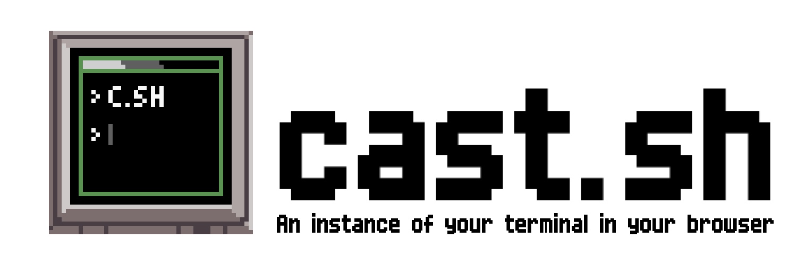

<p align="center">
    <a href="https://travis-ci.org/pod-cast/cast-sh">
        </a>
    <a href="https://github.com/pod-cast/cast-sh/graphs/contributors" alt="Contributors">
        </a>
    <a href='https://coveralls.io/github/pod-cast/cast-sh'></a>
    <a href="https://www.python.org/downloads/">
        </a>
    <a href="https://github.com/pod-cast/cast-sh/pulse" alt="Activity">
        </a>
    <a href="https://github.com/pod-cast/cast-sh/blob/master/LICENSE" alt="License">
        </a>
    <a href="https://app.fossa.com/projects/git%2Bgithub.com%2Fpod-cast%2Fcast-sh?ref=badge_shield" alt="FOSSA Status"></a>
    <a href="https://lgtm.com/projects/g/pod-cast/cast-sh/alerts/">
        </a>
    <a href="https://lgtm.com/projects/g/pod-cast/cast-sh/context:python"></a>
    <a href="https://lgtm.com/projects/g/pod-cast/cast-sh/context:javascript"></a>
</p>

## Installation & Prerequisites
Use the package manager pip to install the dependencies before run the application
```
pip3 install -r requirements.txt
```

## Usage
To start the terminal cast application, run:
```
python3 -m cast
```
#### Arguments
```
optional arguments:

  -h, --help                show this help message and exit
  -p [PORT], --port [PORT]  port to run server on (default: 5000)
  --debug                   debug the server (default: False)
  --version                 print version and exit (default: False)
  --command COMMAND         Command to run in the terminal (default: bash)
  --cmd-args CMD_ARGS       arguments to pass to command (i.e. --cmd-args='arg1
                            arg2 --flag') (default: )
```
#### Docker
Build image
```
docker build -t cast .
```
Run built image
```
docker run --name cast.sh-container -p 5000:5000/tcp -i -t cast
```
## Screenshots


## Contributing

[](https://sourcerer.io/fame/hericlesme/pod-cast/cast-sh/links/0)[](https://sourcerer.io/fame/hericlesme/pod-cast/cast-sh/links/1)[](https://sourcerer.io/fame/hericlesme/pod-cast/cast-sh/links/2)[](https://sourcerer.io/fame/hericlesme/pod-cast/cast-sh/links/3)[](https://sourcerer.io/fame/hericlesme/pod-cast/cast-sh/links/4)[](https://sourcerer.io/fame/hericlesme/pod-cast/cast-sh/links/5)[](https://sourcerer.io/fame/hericlesme/pod-cast/cast-sh/links/6)[](https://sourcerer.io/fame/hericlesme/pod-cast/cast-sh/links/7)

## License
<a href="https://app.fossa.com/projects/git%2Bgithub.com%2Fpod-cast%2Fcast-sh?ref=badge_large" alt="FOSSA Status"></a>

## Code of Conduct
Everyone interacting with the [cast-sh](https://github.com/pod-cast/cast-sh) codebase and issue tracker is expected to follow our [Code of Conduct](https://github.com/pod-cast/cast-sh/blob/dev/CODE_OF_CONDUCT.md).
